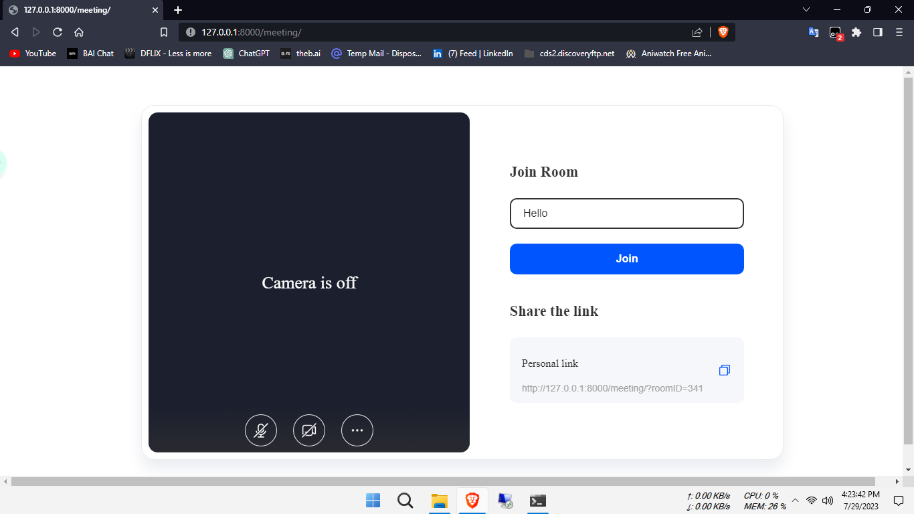

# Django Video Conference with Zenocloud API Integration
## Welcome to the Django Video Conference with Zenocloud API Integration repository! This repository contains the source code for a video conferencing application built using Django and integrated with the Zenocloud API.

### Features
🎥 High-quality video and audio streaming
💬 Real-time chat
🔒 User authentication and access control
🔌 Integration with Zenocloud API for enhanced functionality

Technologies Used
🔹 Django: Web framework for building the application
🐍 Python: Programming language used with Django
🌩️ Zenocloud API: Service used for video conferencing features
🌐 HTML, CSS, JavaScript: Frontend development
🐘 Sqlite: Database for storing application data

Getting Started
To set up the project on your local machine, follow these steps:

Clone this repository: git clone https://github.com/rakibxdev/Video_Conference.git
Create and activate a virtual environment:
For virtualenv:

Create a virtual environment: virtualenv env
Activate the virtual environment:
On Windows: env\Scripts\activate
On macOS and Linux: source env/bin/activate
For venv (Python 3.3+):

Create a virtual environment: python3 -m venv env
then copy pyvenv.cfg and  replace the pyvenv.cfg into the  'VideoConference\env'
Apply migrations to create database tables: python manage.py migrate
Start the development server: python manage.py runserver
Note: Make sure you have obtained the necessary API credentials from Zenocloud and update the appropriate settings in the project for the API integration to work properly.

Configuration
To configure the Zenocloud API integration, update the following settings in settings.py:

## Zenocloud API Configuration

Replace 'YOUR_ZENOCLOUD_API_KEY' and 'YOUR_ZENOCLOUD_API_SECRET' with your own Zenocloud API credentials into  'VideoConference\videoconference_app\templates\videocall.html'

Contributing
If you would like to contribute to this project, please follow these guidelines:

### Fork the repository
Create a new branch for your feature: git checkout -b feature/my-feature
Make your changes and commit them: git commit -m "Add my feature"
Push your changes to your forked repository: git push origin feature/my-feature
Open a pull request to merge your changes into the main repository
Issues
If you encounter any issues or have any suggestions for improvement, please open an issue on the GitHub repository.

License
This project is licensed under the MIT License. See the LICENSE file for more information.

Make sure to update the ZENOCLOUD_API_KEY and ZENOCLOUD_API_SECRET with the respective credentials provided by Zenocloud. Feel free to modify and customize this README.md file according to your project's specific requirements. Let me know if you need any further assistance! 😊
